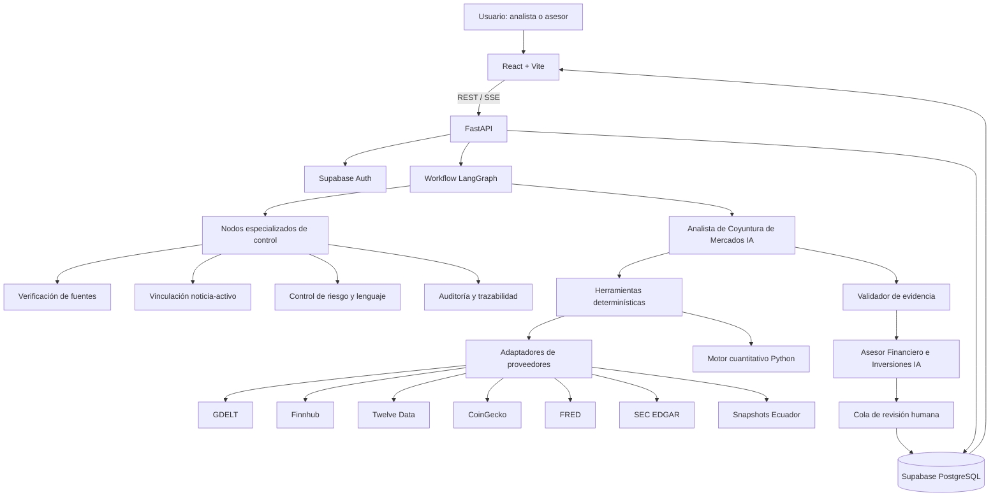
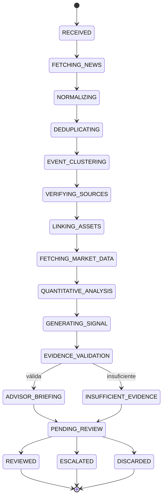
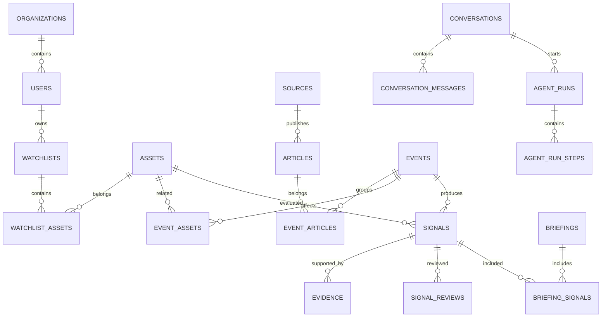
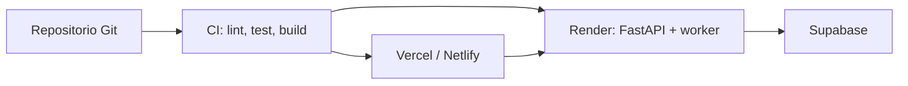

# NexoMercado AI
## Arquitectura general del sistema de inteligencia de mercado y recomendaciones informadas por noticias

**Hackathon de Agentes Financieros IA — Track 5**  
**Fecha de arquitectura:** 11 de julio de 2026  
**Estado:** Propuesta técnica para MVP funcional en 48 horas

---

## 1. Resumen ejecutivo

**NexoMercado AI** es una plataforma de inteligencia financiera que transforma noticias y datos verificables de mercado en señales explicables para analistas e inversionistas.

El sistema no ejecuta compras ni ventas y no promete rendimientos. Su objetivo es reducir el ruido informativo, relacionar noticias con instrumentos financieros, contrastar cada evento con datos históricos y entregar un briefing auditable para revisión humana.

La solución utiliza dos agentes especializados:

1. **Analista de Coyuntura de Mercados IA:** recopila, verifica, agrupa y analiza eventos de mercado.
2. **Asesor Financiero e Inversiones IA:** prioriza las señales verificadas, genera briefings y propone acciones de investigación.

Para reducir fallos, estos dos agentes principales se apoyan en nodos especializados de verificación, cálculo, riesgo, briefing y auditoría. Los nodos especializados no reemplazan a los agentes del Track 5; funcionan como controles internos con responsabilidades pequeñas, verificables y trazables.

La arquitectura separa completamente la interfaz, la API, la lógica agéntica, los cálculos financieros y los proveedores externos. Esto evita construir un prototipo frágil y permite cambiar un proveedor o modelo de IA sin reescribir todo el sistema.

---

## 2. Problema que resuelve

Un analista recibe diariamente noticias repetidas, contradictorias o poco confiables. Para determinar cuáles importan debe:

- Identificar el evento real detrás de varios titulares.
- Verificar la información con más de una fuente.
- Relacionar la noticia con acciones, ETF, instrumentos de crédito, criptomonedas u otros activos.
- Consultar movimientos históricos y benchmarks.
- Determinar si la reacción del precio es relevante o normal.
- Documentar la evidencia y sus contradicciones.
- Preparar un briefing para revisión antes de compartirlo.

NexoMercado AI automatiza ese proceso sin reemplazar la decisión profesional del analista.

---

## 3. Objetivos del producto

### 3.1 Objetivo general

Convertir noticias y datos de mercado verificables en señales financieras explicables, trazables y revisables por una persona.

### 3.2 Objetivos específicos

- Mostrar noticias recientes de al menos dos fuentes.
- Filtrar por activo, instrumento, sector, tema y antigüedad.
- Agrupar noticias que describen el mismo evento.
- Relacionar cada evento con uno o más instrumentos financieros.
- Clasificar el impacto como positivo, negativo, neutral o incierto.
- Calcular un nivel de confianza basado en evidencia verificable.
- Comparar el evento con movimientos reales o datos históricos.
- Mostrar evidencia favorable y contradictoria.
- Generar briefings por activo o lista de seguimiento.
- Permitir marcar señales como revisadas, escaladas o descartadas.
- Guardar la justificación y el historial de decisiones del analista.
- Mantener continuidad en las conversaciones.
- Abstenerse de concluir cuando no exista evidencia suficiente.

---

## 4. Principios de diseño

### 4.1 Evidencia antes que opinión

Ninguna afirmación financiera importante se genera sin una fuente o un cálculo asociado.

```text
claim_id → evidence_id → source_id → URL/documento → fecha → snapshot
```

### 4.2 Cálculos determinísticos

El modelo de lenguaje no calcula precios, retornos, porcentajes, volatilidad ni confianza. Estas operaciones son realizadas por funciones Python verificables.

### 4.3 Dos agentes principales con controles especializados

El sistema mantiene dos agentes principales alineados con el Track 5: el Analista de Coyuntura de Mercados IA y el Asesor Financiero e Inversiones IA.

Para disminuir la probabilidad de fallos, la orquestación se divide en nodos especializados:

- Verificación de fuentes y fechas.
- Vinculación noticia-activo.
- Cálculo cuantitativo determinístico.
- Validación de evidencia y contradicciones.
- Control de riesgo, lenguaje y abstención.
- Construcción de briefing.
- Auditoría del recorrido completo.

Estos nodos pueden implementarse como herramientas, servicios o subroles supervisados por LangGraph. No toman decisiones financieras autónomas ni sustituyen la revisión humana.

### 4.4 Revisión humana obligatoria

La IA prepara señales y briefings, pero una persona decide si cada señal es revisada, escalada o descartada.

### 4.5 Abstención segura

Cuando los datos son insuficientes, contradictorios o antiguos, la salida debe ser `incierta` o `evidencia insuficiente`.

### 4.6 Proveedores intercambiables

Cada fuente externa implementa un contrato común para que pueda ser reemplazada sin modificar el frontend ni los agentes.

### 4.7 Reproducibilidad

Cada análisis guarda qué datos, herramientas, modelo, prompt y versión de código fueron utilizados.

---

## 5. Arquitectura de alto nivel



---

## 6. Stack tecnológico

| Capa | Tecnología | Responsabilidad |
|---|---|---|
| Frontend | React + Vite + TypeScript | Interfaz SPA y experiencia del analista |
| Rutas | React Router | Navegación entre radar, señales y briefings |
| Datos remotos | TanStack Query | Caché, reintentos y sincronización con API |
| Estado local | Zustand | Filtros, sesión visual y estado efímero |
| UI | Tailwind CSS + shadcn/ui | Componentes consistentes y accesibles |
| Formularios | React Hook Form + Zod | Validación de revisiones y filtros |
| Gráficos | Lightweight Charts o Recharts | Precios, benchmarks y ventanas del evento |
| Backend | Python + FastAPI | API, permisos, validación y orquestación |
| Contratos | Pydantic | Entradas y salidas estrictamente tipadas |
| Agentes | LangGraph | Estado, checkpoints y human-in-the-loop |
| Cálculos | Pandas + NumPy | Retornos, volumen, volatilidad y benchmarks |
| Base de datos | Supabase PostgreSQL | Persistencia relacional y auditoría |
| Vectores | pgvector | Detección de eventos y noticias similares |
| Autenticación | Supabase Auth | Inicio de sesión y roles |
| Seguridad de datos | PostgreSQL RLS | Aislamiento por organización y usuario |
| Streaming | Server-Sent Events | Progreso de análisis en tiempo real |
| Observabilidad | OpenTelemetry + tablas de auditoría | Trazas, errores, latencia y uso de herramientas |
| Frontend hosting | Vercel o Netlify | Despliegue de React estático |
| Backend hosting | Render | FastAPI y worker Python |
| Base de datos | Supabase Cloud | PostgreSQL administrado |

---

## 7. Arquitectura del frontend

### 7.1 Responsabilidades

El frontend:

- Presenta radar, señales, evidencia, briefings y auditoría.
- Envía solicitudes al backend.
- Escucha el progreso de los workflows mediante SSE.
- Permite revisar, escalar o descartar señales.
- No contiene reglas financieras críticas.
- No consume directamente APIs de mercado.
- No almacena API keys privadas.

### 7.2 Vistas principales

#### Radar de mercado

- Noticias y eventos recientes.
- Activos relacionados.
- Clasificación de impacto.
- Confianza.
- Movimiento del activo.
- Fuentes.
- Estado de revisión.
- Filtros por instrumento, activo, sector, antigüedad y confianza.

#### Detalle de señal

- Tesis principal.
- Impacto y confianza.
- Gráfico de precio con marcador temporal del evento.
- Comparación contra benchmark.
- Evidencia favorable y contradictoria.
- Supuestos.
- Condiciones de invalidación.
- Acciones de investigación.
- Revisión del analista.

#### Briefing

- Resumen ejecutivo.
- Señales priorizadas.
- Noticias relacionadas.
- Movimientos asociados.
- Acciones sugeridas.
- Estado de revisión por señal.

#### Auditoría

- Pasos ejecutados.
- Proveedores consultados.
- Reintentos y fallbacks.
- Modelo y versión del prompt.
- Errores o advertencias.

### 7.3 Estructura propuesta

```text
frontend/
├── src/
│   ├── app/
│   │   ├── App.tsx
│   │   ├── router.tsx
│   │   └── providers.tsx
│   ├── components/
│   │   ├── ui/
│   │   ├── charts/
│   │   ├── evidence/
│   │   └── layout/
│   ├── features/
│   │   ├── radar/
│   │   ├── signals/
│   │   ├── briefings/
│   │   ├── reviews/
│   │   ├── watchlists/
│   │   ├── conversations/
│   │   └── audit/
│   ├── hooks/
│   ├── lib/
│   ├── services/
│   ├── stores/
│   ├── types/
│   └── main.tsx
├── package.json
├── tsconfig.json
└── vite.config.ts
```

---

## 8. Arquitectura del backend

### 8.1 Responsabilidades

FastAPI funciona como única puerta de entrada a la lógica del sistema. Se encarga de:

- Validar entradas y salidas.
- Autenticar usuarios.
- Aplicar permisos.
- Administrar cuotas y caché.
- Ejecutar workflows.
- Consultar proveedores.
- Persistir resultados.
- Emitir eventos de progreso.
- Registrar auditoría.
- Aplicar reglas antialucinación.

### 8.2 Estructura propuesta

```text
backend/
├── app/
│   ├── main.py
│   ├── config.py
│   ├── api/
│   │   ├── dependencies.py
│   │   └── v1/
│   │       ├── analyses.py
│   │       ├── signals.py
│   │       ├── reviews.py
│   │       ├── briefings.py
│   │       ├── watchlists.py
│   │       ├── conversations.py
│   │       └── runs.py
│   ├── agents/
│   │   ├── market_analyst/
│   │   └── financial_advisor/
│   ├── workflows/
│   │   ├── market_analysis_graph.py
│   │   └── state.py
│   ├── tools/
│   │   ├── news_tools.py
│   │   ├── market_tools.py
│   │   ├── evidence_tools.py
│   │   └── review_tools.py
│   ├── providers/
│   │   ├── base.py
│   │   ├── gdelt.py
│   │   ├── finnhub.py
│   │   ├── twelve_data.py
│   │   ├── coingecko.py
│   │   ├── fred.py
│   │   ├── sec_edgar.py
│   │   └── ecuador_snapshots.py
│   ├── calculations/
│   │   ├── returns.py
│   │   ├── abnormal_returns.py
│   │   ├── volume.py
│   │   ├── volatility.py
│   │   └── confidence.py
│   ├── evidence/
│   │   ├── verifier.py
│   │   ├── source_ranking.py
│   │   └── claim_mapper.py
│   ├── models/
│   ├── repositories/
│   ├── services/
│   ├── security/
│   └── telemetry/
└── pyproject.toml
```

---

## 9. Workflow agéntico

El workflow se diseña como una orquestación supervisada. Los dos agentes principales concentran el razonamiento de mercado y la generación de briefing, mientras los nodos especializados controlan pasos que deben ser verificables.



### 9.1 Estado persistente del workflow

```python
class MarketAnalysisState(TypedDict):
    run_id: str
    conversation_id: str
    user_query: str
    filters: dict
    articles: list
    events: list
    related_assets: list
    market_snapshots: list
    quantitative_results: list
    signals: list
    evidence: list
    warnings: list
    current_node: str
    status: str
```

Cada nodo guarda un checkpoint. Si una API falla o el proceso se interrumpe, el workflow puede reanudarse desde el último punto confirmado.

### 9.2 Nodos especializados de control

| Nodo | Responsabilidad | Tipo de salida |
|---|---|---|
| `normalize_news` | Normalizar noticia, fuente, fecha, URL y publisher | Artículos canónicos |
| `verify_sources` | Confirmar fuente, independencia editorial, fecha y modo de datos | Evidencia de fuente |
| `link_assets` | Relacionar eventos con activos, sectores o instrumentos | Relaciones noticia-activo |
| `calculate_reactions` | Calcular retornos, benchmark, volumen relativo y métricas | Resultados cuantitativos |
| `validate_evidence` | Comprobar que cada claim tenga evidencia o contraevidencia | Resultado de validación |
| `abstention_guard` | Forzar `uncertain` o `insufficient_evidence` si falta soporte | Estado seguro |
| `risk_language_guard` | Bloquear lenguaje de compra, venta o promesa de rendimiento | Texto permitido |
| `briefing_builder` | Armar briefing con señales elegibles | Briefing draft/shareable |
| `audit_writer` | Registrar pasos, snapshots, hashes, modelo y advertencias | Trazabilidad |

Estos nodos reducen la superficie de error porque cada parte del análisis tiene una entrada, una salida y una regla de aceptación explícita.

### 9.3 Roles internos supervisados

Cuando se explique la arquitectura, puede describirse que los agentes principales coordinan roles internos especializados:

- **Verificador de fuentes:** revisa publisher, fecha, URL, independencia y duplicados.
- **Analista cuantitativo:** interpreta resultados generados por funciones Python, sin inventar cifras.
- **Validador de evidencia:** exige trazabilidad `claim -> evidence -> source/snapshot`.
- **Control de riesgo y cumplimiento:** evita asesoría personalizada, promesas de rendimiento y lenguaje operativo.
- **Redactor de briefing:** convierte señales validadas en un resumen claro para revisión.
- **Auditor:** registra pasos, modo de datos, proveedor, hashes y advertencias.

Estos roles no ejecutan operaciones ni aprueban señales por sí solos. La decisión final permanece en la revisión humana.

---

## 10. Agente 1: Analista de Coyuntura de Mercados IA

### 10.1 Propósito

Transformar noticias dispersas en eventos financieros verificados y señales explicables.

### 10.2 Responsabilidades

1. Interpretar la consulta del usuario.
2. Buscar noticias en al menos dos fuentes.
3. Normalizar formatos.
4. Eliminar duplicados exactos y semánticos.
5. Agrupar artículos que describen el mismo evento.
6. Identificar empresas, sectores, indicadores y activos.
7. Buscar una fuente primaria cuando exista.
8. Consultar precios y datos históricos.
9. Ejecutar cálculos cuantitativos mediante herramientas.
10. Identificar evidencia favorable y contradictoria.
11. Clasificar el impacto.
12. Aplicar reglas de confianza y abstención.

### 10.3 Herramientas permitidas

```text
search_general_news()
search_financial_news()
normalize_articles()
deduplicate_articles()
cluster_events()
find_primary_sources()
link_assets()
get_stock_prices()
get_crypto_prices()
get_macro_series()
get_sec_filings()
get_ecuador_snapshot()
calculate_event_metrics()
calculate_confidence()
find_similar_events()
```

### 10.4 Límites

El Analista no puede:

- Inventar precios o porcentajes.
- Ejecutar compras o ventas.
- Prometer rendimientos.
- Declarar causalidad sin evidencia suficiente.
- Ocultar contradicciones.
- Marcar una señal como revisada en nombre de una persona.

---

## 11. Agente 2: Asesor Financiero e Inversiones IA

### 11.1 Propósito

Convertir señales verificadas en un briefing priorizado y comprensible para revisión humana.

### 11.2 Responsabilidades

1. Recibir exclusivamente señales procesadas por el Analista.
2. Priorizar eventos por watchlist o instrumento.
3. Explicar las implicaciones de manera prudente.
4. Resumir evidencia y riesgos.
5. Proponer acciones de investigación.
6. Comparar señales y eventos anteriores.
7. Mantener continuidad conversacional.
8. Preparar el briefing.
9. Enviar las señales a revisión humana.

### 11.3 Lenguaje permitido

```text
"Este evento merece una revisión prioritaria por su movimiento anormal
frente al benchmark y por estar respaldado por dos fuentes independientes."
```

```text
"Se sugiere revisar el siguiente informe corporativo y comparar los
márgenes con competidores antes de extraer una conclusión."
```

### 11.4 Lenguaje prohibido

```text
"Compra esta acción."
"Vende todos tus activos."
"Esta inversión rendirá un 20 %."
"El precio definitivamente subirá mañana."
```

---

## 12. Herramientas determinísticas y motor cuantitativo

Los agentes no realizan cálculos manualmente. Invocan funciones que producen resultados reproducibles.

### 12.1 Métricas iniciales

- Retorno del activo antes y después del evento.
- Retorno del benchmark.
- Retorno anormal.
- Volumen relativo frente a media de 20 sesiones.
- Volatilidad histórica.
- Máxima caída en la ventana.
- Persistencia del movimiento.
- Diferencia entre hora del movimiento y hora de publicación.

### 12.2 Retorno anormal simplificado

```text
retorno_anormal = retorno_activo - retorno_benchmark
```

### 12.3 Ejemplo

```json
{
  "assetReturn": -0.041,
  "benchmarkReturn": -0.008,
  "abnormalReturn": -0.033,
  "relativeVolume": 2.4,
  "volatilityZScore": 2.1
}
```

### 12.4 Advertencia metodológica

El retorno anormal es una señal de priorización, no una demostración automática de causalidad.

---

## 13. Proveedores de datos

### 13.1 Matriz de proveedores

| Información | Principal | Respaldo o verificación |
|---|---|---|
| Noticias generales | GDELT | Finnhub |
| Noticias financieras | Finnhub | GDELT |
| Precios de acciones y ETF | Twelve Data | Caché o dataset de prueba |
| Criptoactivos | CoinGecko | Twelve Data o caché |
| Información corporativa oficial | SEC EDGAR | Documentos almacenados |
| Indicadores macroeconómicos | FRED | Snapshots almacenados |
| Contexto ecuatoriano | Snapshots oficiales versionados | Feed JSON de demostración |

### 13.2 GDELT

Uso principal:

- Noticias globales.
- Contexto geopolítico.
- Búsqueda por empresa, sector o tema.
- Segunda fuente para corroboración.

Se utiliza mediante un worker de ingesta; el frontend nunca consulta GDELT directamente.

### 13.3 Finnhub

Uso principal:

- Noticias por empresa.
- Noticias generales de mercado.
- Perfil y símbolos de compañías.
- Cotización básica o fallback.

El plan y las condiciones de licencia deben revisarse antes de uso comercial.

### 13.4 Twelve Data

Uso principal:

- Series históricas de acciones y ETF.
- Datos de mercado para gráficos.
- Forex si se incorpora al MVP.

A julio de 2026, el plan Basic publicado ofrece 8 créditos por minuto y 800 por día. Los límites se encapsulan en un servicio de presupuesto para impedir que la UI los consuma accidentalmente.

### 13.5 CoinGecko

Uso principal:

- Precios de criptomonedas.
- Capitalización y volumen.
- Series históricas y OHLC.

A julio de 2026, CoinGecko publica un plan Demo gratuito con 100 llamadas por minuto y 10.000 llamadas mensuales. Estos valores deben tratarse como configuración, no como constantes de negocio.

### 13.6 FRED

Uso principal:

- Tasas de interés.
- Inflación.
- Desempleo.
- Bonos del Tesoro.
- Petróleo y volatilidad.

Series sugeridas para el MVP:

```text
FEDFUNDS
CPIAUCSL
UNRATE
DGS10
DCOILWTICO
VIXCLS
```

### 13.7 SEC EDGAR

Uso principal:

- Historial de presentaciones por compañía.
- Reportes 10-K, 10-Q y 8-K.
- Datos XBRL verificables.
- Confirmación de cifras corporativas.

Las APIs de `data.sec.gov` no requieren API key, pero las solicitudes deben realizarse desde el backend y respetar las políticas de acceso justo de la SEC.

---

## 14. Módulo de contexto ecuatoriano

### 14.1 Decisión de arquitectura

El contexto ecuatoriano no se presenta como una API en tiempo real. Para el MVP se implementa como un proveedor de **snapshots institucionales versionados**.

### 14.2 Fuentes posibles

- Banco Central del Ecuador.
- Superintendencia de Compañías, Valores y Seguros.
- Bolsas de Valores de Quito o Guayaquil.
- Documentos públicos o datasets preparados para demostración.

### 14.3 Alcance del MVP

- Precio internacional del petróleo.
- Riesgo país o indicador soberano de prueba.
- Indicadores macroeconómicos seleccionados.
- Boletines públicos de mercado.

### 14.4 Estructura de archivos

```text
data/
└── ecuador/
    ├── bce_macro_snapshot.json
    ├── sovereign_risk_snapshot.csv
    ├── market_bulletins.json
    └── sources_manifest.json
```

### 14.5 Metadatos obligatorios

```json
{
  "datasetId": "ecuador_macro_001",
  "name": "Indicadores macroeconómicos de Ecuador",
  "institution": "Institución de origen",
  "sourceUrl": "URL del documento original",
  "publishedAt": "2026-07-01T00:00:00Z",
  "retrievedAt": "2026-07-10T20:30:00Z",
  "dataAsOf": "2026-06-30",
  "fileHash": "sha256:...",
  "isLiveData": false
}
```

La interfaz debe mostrar que los datos son versionados y que no corresponden a información en tiempo real.

---

## 15. Patrón de proveedores intercambiables

```python
from typing import Protocol

class NewsProvider(Protocol):
    async def search(self, query: str, start_at: str, end_at: str) -> list: ...

class MarketDataProvider(Protocol):
    async def get_series(self, symbol: str, interval: str) -> list: ...

class InstitutionalProvider(Protocol):
    async def get_documents(self, entity: str) -> list: ...
```

Los agentes invocan servicios internos, no SDKs de proveedores concretos. Así, por ejemplo, Twelve Data puede ser reemplazado por otro proveedor sin cambiar el contrato del agente.

---

## 16. Estrategia de consumo y control de cuotas

### 16.1 Regla principal

El frontend nunca llama directamente a proveedores externos.

```text
Proveedor externo → backend/worker → caché/base de datos → API propia → React
```

### 16.2 Caché por tipo de dato

| Tipo de dato | TTL sugerido |
|---|---:|
| Noticias recientes | 5–10 minutos |
| Cotización en mercado abierto | 5 minutos |
| Serie diaria | 30 minutos |
| Histórico de 90 días | 12 horas |
| Perfil de activo | 7 días |
| Datos macro | 12–24 horas |
| Documentos institucionales | Según fecha de publicación |

### 16.3 Tabla de caché

```text
provider_cache
- cache_key
- provider
- request_params_hash
- response_json
- fetched_at
- expires_at
- request_cost
- status_code
```

### 16.4 Presupuesto de solicitudes

```text
provider_budgets
- provider
- period_type
- max_requests
- used_requests
- reset_at
- safety_reserve
```

### 16.5 Circuit breaker

Estados:

```text
CLOSED → proveedor disponible
OPEN → proveedor bloqueado temporalmente
HALF_OPEN → solicitud de prueba
```

Cuando se activa un fallback, el sistema registra el cambio y reduce la confianza si la calidad o frescura de los datos es inferior.

---

## 17. Ingesta y workers

```text
worker/
├── ingest_news.py
├── refresh_market_data.py
├── refresh_macro_data.py
├── import_ecuador_snapshots.py
├── reconcile_sources.py
└── cleanup_cache.py
```

### 17.1 Frecuencias sugeridas

| Worker | Frecuencia MVP |
|---|---|
| Noticias watchlist | Cada 10 minutos |
| Precios watchlist | Cada 5 minutos durante demo |
| Series históricas | Bajo demanda con caché |
| Datos macro | Una vez al día |
| Snapshots Ecuador | Manual o bajo despliegue |
| Limpieza de caché | Cada hora |

---

## 18. Normalización, deduplicación y agrupamiento

### 18.1 Normalización

Todos los artículos se convierten a un esquema común:

```json
{
  "headline": "...",
  "source": "...",
  "publishedAt": "...",
  "retrievedAt": "...",
  "url": "...",
  "language": "es",
  "contentHash": "..."
}
```

### 18.2 Deduplicación exacta

- URL canónica.
- Hash del título y contenido.
- Mismo proveedor e identificador.

### 18.3 Deduplicación semántica

- Embeddings de título y resumen.
- Comparación con pgvector.
- Umbral configurable.
- Validación por entidad y ventana temporal.

### 18.4 Agrupamiento de eventos

Varios artículos pueden pertenecer a un mismo evento:

```text
10 artículos → 1 evento canónico → 3 fuentes independientes
```

El número de artículos no se confunde con el número de fuentes independientes.

---

## 19. Relación entre noticias y activos

### 19.1 Tipos de relación

```text
direct
sector
competitor
supply_chain
macro
commodity
credit
indirect
```

### 19.2 Contrato

```json
{
  "symbol": "AAPL",
  "relationship": "direct",
  "reason": "La noticia corresponde a la compañía emisora.",
  "entityMatchScore": 0.98
}
```

### 19.3 Reglas

- Un ticker no se acepta solo por coincidencia textual.
- Se valida nombre, bolsa, sector y contexto.
- Relaciones indirectas deben tener menor confianza.
- Las asociaciones dudosas se presentan como hipótesis.

---

## 20. Clasificación de impacto

### 20.1 Valores válidos

```text
positive
negative
neutral
uncertain
```

### 20.2 Horizonte

```text
immediate
short_term
medium_term
unknown
```

### 20.3 Señal base

```json
{
  "impact": "negative",
  "timeHorizon": "short_term",
  "thesis": "...",
  "supportingEvidenceIds": ["ev_001", "ev_002"],
  "counterEvidenceIds": ["ev_003"],
  "assumptions": ["..."],
  "invalidationConditions": ["..."],
  "researchActions": ["..."]
}
```

---

## 21. Confianza calculada

El LLM no inventa el porcentaje. El valor se calcula mediante una fórmula configurable.

### 21.1 Propuesta inicial

```text
25 % calidad de fuentes
20 % corroboración entre fuentes
20 % certeza de relación con el activo
20 % coherencia con datos de mercado
15 % frescura y completitud
```

### 21.2 Ejemplo

```text
Calidad de fuentes:       0.90
Corroboración:            0.80
Relación con activo:      1.00
Coherencia con mercado:   0.65
Frescura:                 0.95

Confianza final:          0.84
```

### 21.3 Penalizaciones

- Fuente primaria ausente.
- Solo una fuente disponible.
- Contradicción no resuelta.
- Datos de mercado incompletos.
- Uso de fallback menos fresco.
- Activo con baja liquidez.
- Mercado cerrado o ventana inválida.

---

## 22. Antialucinación y mitigación de riesgos

### 22.1 Reglas principales

1. Sin evidencia no hay afirmación financiera.
2. Cada cifra debe provenir de una herramienta o fuente.
3. Las salidas del LLM deben cumplir un esquema estructurado.
4. El backend rechaza IDs de evidencia inexistentes.
5. Las fechas y símbolos deben validarse.
6. Las contradicciones deben conservarse.
7. La confianza se calcula por código.
8. La IA debe abstenerse cuando no alcance el umbral mínimo.
9. No se ejecutan operaciones financieras.
10. Toda respuesta incluye una advertencia de alcance.

### 22.2 Clasificación de fuentes

| Nivel | Tipo de fuente |
|---|---|
| A | Regulador, banco central, bolsa, emisor o documento oficial |
| B | Agencia financiera o medio especializado reconocido |
| C | Periódico general |
| D | Blog, red social o fuente no verificada |

### 22.3 Reglas de abstención

El sistema se abstiene cuando:

- Solo existe una fuente débil.
- No se identifica correctamente el activo.
- La noticia está fuera de la ventana solicitada.
- No hay datos históricos suficientes.
- Las fuentes se contradicen de manera material.
- El precio comenzó a moverse antes del evento y no hay explicación.
- La relación entre evento y activo es especulativa.
- Fallan los proveedores críticos y no existe snapshot.

Salida sugerida:

```text
No existe evidencia suficiente para clasificar el impacto con una
confianza aceptable. La señal se mantiene como incierta y requiere
revisión humana.
```

---

## 23. Modelo de revisión humana

### 23.1 Separación de estados

```typescript
type AnalysisStatus =
  | "processing"
  | "completed"
  | "insufficient_evidence"
  | "failed";

type ReviewStatus =
  | "pending_review"
  | "reviewed"
  | "escalated"
  | "discarded";
```

### 23.2 Reglas

- Toda señal inicia en `pending_review`.
- La IA no puede cambiar el estado a `reviewed`.
- La justificación es obligatoria para `reviewed`, `escalated` y `discarded`.
- `reviewedBy` se obtiene del usuario autenticado.
- `reviewedAt` se genera en el servidor.
- Cada cambio crea un registro inmutable.
- Las señales descartadas no aparecen en el briefing compartible.
- Las señales escaladas se muestran con advertencia.
- Solo señales revisadas pueden quedar listas para compartir.

### 23.3 Contrato de revisión

```json
{
  "status": "escalated",
  "justification": "El movimiento comenzó antes de la publicación oficial.",
  "reviewedBy": {
    "id": "usr_014",
    "name": "Analista de mercado"
  },
  "reviewedAt": "2026-07-11T15:42:10Z"
}
```

---

## 24. Modelo de datos

### 24.1 Tablas principales

```text
organizations
users
watchlists
watchlist_assets
sources
articles
events
event_articles
assets
event_assets
market_snapshots
signals
evidence
briefings
briefing_signals
signal_reviews
conversations
conversation_messages
agent_runs
agent_run_steps
provider_cache
provider_budgets
institutional_datasets
```

### 24.2 Relaciones principales



### 24.3 Tabla `signals`

```text
signals
- id
- organization_id
- event_id
- asset_id
- impact
- time_horizon
- confidence
- thesis
- assumptions_json
- invalidation_conditions_json
- research_actions_json
- analysis_status
- current_review_status
- requires_human_review
- created_at
- updated_at
```

### 24.4 Tabla `signal_reviews`

```text
signal_reviews
- id
- signal_id
- previous_status
- new_status
- justification
- reviewed_by
- reviewed_at
- created_at
```

### 24.5 Tabla `evidence`

```text
evidence
- id
- signal_id
- article_id
- source_id
- claim
- excerpt
- evidence_type
- supports_signal
- source_url
- published_at
- retrieved_at
- content_hash
```

### 24.6 Tabla `agent_runs`

```text
agent_runs
- id
- organization_id
- conversation_id
- current_node
- status
- model_name
- prompt_version
- input_hash
- source_snapshot_ids
- started_at
- finished_at
- error_code
- retry_count
```

---

## 25. Contrato completo de señal

```json
{
  "id": "sig_001",
  "eventId": "evt_001",
  "asset": {
    "symbol": "AAPL",
    "name": "Apple Inc.",
    "instrumentType": "equity"
  },
  "impact": "negative",
  "timeHorizon": "short_term",
  "confidence": 0.81,
  "analysisStatus": "completed",
  "requiresHumanReview": true,
  "thesis": "La reducción de previsiones podría presionar las expectativas de corto plazo.",
  "priceReaction": {
    "assetReturn": -0.041,
    "benchmarkReturn": -0.008,
    "abnormalReturn": -0.033,
    "relativeVolume": 2.4
  },
  "evidenceIds": ["evidence_001", "evidence_002"],
  "counterEvidenceIds": ["evidence_003"],
  "assumptions": [
    "El comunicado fue publicado antes del movimiento principal."
  ],
  "invalidationConditions": [
    "La compañía restablece su previsión anterior.",
    "La caída se revierte con volumen superior al promedio."
  ],
  "suggestedResearchActions": [
    "Revisar el último reporte corporativo.",
    "Comparar el movimiento con el ETF sectorial."
  ],
  "review": {
    "status": "pending_review",
    "justification": null,
    "reviewedBy": null,
    "reviewedAt": null
  },
  "createdAt": "2026-07-11T15:30:00Z",
  "updatedAt": "2026-07-11T15:30:00Z"
}
```

---

## 26. Contrato de briefing

```json
{
  "briefingId": "brief_001",
  "watchlist": {
    "id": "watchlist_tech",
    "name": "Tecnología"
  },
  "executiveSummary": "Se identificaron tres eventos relevantes.",
  "prioritizedSignals": [
    {
      "signalId": "sig_001",
      "priority": "high",
      "reason": "Movimiento anormal respaldado por fuentes independientes.",
      "suggestedResearchActions": [
        "Revisar el documento corporativo original.",
        "Comparar márgenes con competidores."
      ],
      "review": {
        "status": "pending_review",
        "justification": null
      }
    }
  ],
  "humanReviewSummary": {
    "totalSignals": 3,
    "pendingReview": 3,
    "reviewed": 0,
    "escalated": 0,
    "discarded": 0
  },
  "requiresHumanReview": true
}
```

---

## 27. API REST

### 27.1 Análisis

```http
POST /api/v1/analyses
GET  /api/v1/analyses/{runId}
GET  /api/v1/analyses/{runId}/events
```

### 27.2 Señales

```http
GET /api/v1/signals
GET /api/v1/signals/{signalId}
GET /api/v1/signals/{signalId}/evidence
```

Filtros sugeridos:

```text
instrumentType
asset
sector
impact
minConfidence
reviewStatus
publishedAfter
publishedBefore
```

### 27.3 Revisión humana

```http
POST /api/v1/signals/{signalId}/reviews
GET  /api/v1/signals/{signalId}/reviews
```

Solicitud:

```json
{
  "decision": "escalated",
  "justification": "El movimiento comenzó antes de la publicación oficial."
}
```

### 27.4 Briefings

```http
POST /api/v1/briefings
GET  /api/v1/briefings/{briefingId}
GET  /api/v1/briefings/{briefingId}/review-summary
```

### 27.5 Conversaciones

```http
POST /api/v1/conversations
POST /api/v1/conversations/{conversationId}/messages
GET  /api/v1/conversations/{conversationId}
```

### 27.6 Auditoría

```http
GET /api/v1/runs/{runId}
GET /api/v1/runs/{runId}/steps
GET /api/v1/runs/{runId}/stream
```

---

## 28. Continuidad conversacional

Cada conversación conserva:

```text
conversation_id
user_id
organization_id
watchlist_id
active_assets
active_event_id
active_signal_id
message_history
summary
last_run_id
created_at
updated_at
```

El sistema debe resolver preguntas como:

```text
"¿Qué podría invalidar esta señal?"
"Compárala con el evento anterior."
"Muéstrame solo las señales escaladas de esta watchlist."
```

El backend recupera el contexto almacenado y no depende exclusivamente del historial enviado por el navegador.

---

## 29. Seguridad

### 29.1 Autenticación y autorización

Roles iniciales:

```text
analyst
senior_analyst
advisor
admin
```

### 29.2 Políticas sugeridas

- Un usuario solo accede a datos de su organización.
- Un analista puede revisar señales de su organización.
- Un asesor puede generar briefings con señales autorizadas.
- Un administrador puede gestionar fuentes, usuarios y configuraciones.
- Las API keys externas solo existen en el backend.
- Las tablas expuestas utilizan RLS.

### 29.3 Protección adicional

- Validación estricta con Pydantic y Zod.
- Rate limiting por usuario.
- Sanitización de parámetros de búsqueda.
- Secretos en variables de entorno.
- Logs sin API keys ni contenido sensible innecesario.
- CORS restringido al dominio del frontend.
- IDs UUID no secuenciales.

---

## 30. Observabilidad y auditoría

Cada ejecución debe registrar:

- Nodo actual.
- Inicio y fin.
- Proveedor utilizado.
- Parámetros normalizados.
- Resultado o error.
- Número de reintentos.
- Uso de caché.
- Activación de fallback.
- Modelo de IA.
- Versión del prompt.
- Tokens y latencia.
- IDs de evidencia.

### 30.1 Ejemplo de historial visible

```text
✓ Recuperó 18 artículos
✓ Eliminó 11 duplicados
✓ Agrupó 7 artículos en 2 eventos
✓ Identificó 4 activos
✓ Consultó precios históricos
✓ Detectó una contradicción
✓ Calculó confianza de 78 %
✓ Envió la señal a revisión humana
```

---

## 31. Manejo de errores y resiliencia

### 31.1 Reintentos

- Solo errores transitorios.
- Backoff exponencial.
- Máximo configurable.
- No repetir automáticamente solicitudes inválidas.

### 31.2 Fallback

```text
Twelve Data falla
→ consulta caché válida
→ si no existe, utiliza dataset de demostración
→ agrega advertencia
→ reduce confianza
```

### 31.3 Degradación controlada

La aplicación puede seguir funcionando sin datos en vivo mediante snapshots preparados. La interfaz debe indicar claramente la antigüedad y procedencia de cada dato.

### 31.4 Idempotencia

Una misma solicitud con la misma clave de idempotencia no crea análisis ni revisiones duplicadas.

---

## 32. Pruebas

### 32.1 Unitarias

- Cálculo de retornos.
- Cálculo de confianza.
- Detección de duplicados.
- Reglas de abstención.
- Validación de estados de revisión.

### 32.2 Integración

- Adaptadores de proveedores con respuestas grabadas.
- Persistencia del workflow.
- Creación de señal y evidencia.
- Revisión y auditoría.

### 32.3 Contract tests

- Respuesta de cada proveedor contra el modelo normalizado.
- JSON del agente contra Pydantic.
- Contratos frontend-backend.

### 32.4 End-to-end

```text
Buscar noticia
→ crear evento
→ relacionar activo
→ consultar precio
→ generar señal
→ mostrar evidencia
→ escalar con justificación
→ generar briefing
```

### 32.5 Pruebas antialucinación

- Fuente inexistente.
- Ticker ambiguo.
- Precio no disponible.
- Fuentes contradictorias.
- Fecha futura.
- Cifra no respaldada.
- Movimiento anterior al evento.

---

## 33. Despliegue



### 33.1 Variables de entorno

```text
VITE_API_BASE_URL
SUPABASE_URL
SUPABASE_ANON_KEY
SUPABASE_SERVICE_ROLE_KEY
DATABASE_URL
OPENAI_API_KEY
FINNHUB_API_KEY
TWELVE_DATA_API_KEY
COINGECKO_API_KEY
FRED_API_KEY
SEC_USER_AGENT
```

La clave `SUPABASE_SERVICE_ROLE_KEY` y las claves de proveedores nunca deben incluirse en el frontend.

---

## 34. Repositorio general

```text
nexomercado-ai/
├── frontend/
├── backend/
├── worker/
├── supabase/
│   ├── migrations/
│   └── seed.sql
├── data/
│   ├── demo/
│   └── ecuador/
├── tests/
│   ├── fixtures/
│   └── e2e/
├── docs/
│   ├── architecture.md
│   ├── api.md
│   ├── data-providers.md
│   └── demo-script.md
├── docker-compose.yml
├── .env.example
├── README.md
└── LICENSE
```

---

## 35. Alcance del MVP en 48 horas

### 35.1 P0 — Obligatorio

- React + Vite funcional.
- FastAPI funcional.
- Supabase con esquema mínimo.
- Dos agentes claramente separados.
- GDELT y Finnhub o feeds de prueba como dos fuentes.
- Twelve Data para serie de precios de una watchlist limitada.
- CoinGecko para al menos un criptoactivo.
- Agrupación y deduplicación básica.
- Relación noticia-activo.
- Impacto positivo, negativo, neutral o incierto.
- Confianza calculada.
- Comparación con histórico o benchmark.
- Evidencia visible.
- Briefing.
- Revisión `reviewed`, `escalated` o `discarded` con justificación.
- Auditoría de pasos.
- Datos de demo almacenados como fallback.

### 35.2 P1 — Diferenciadores

- Evidencia contradictoria.
- Condiciones de invalidación.
- Casos históricos similares.
- Retorno anormal.
- Circuit breaker visible.
- Continuidad conversacional.
- Snapshot ecuatoriano trazable.

### 35.3 P2 — Después del hackathon

- Tiempo real de alta frecuencia.
- Más bolsas y proveedores.
- Integración comercial con fuentes licenciadas.
- Roles empresariales avanzados.
- Alertas programadas.
- Exportación PDF y correo.
- Modelos estadísticos avanzados.
- Aplicación móvil.

---

## 36. Correspondencia con criterios de aceptación

| Criterio del Track 5 | Implementación |
|---|---|
| Noticias recientes de al menos dos fuentes | GDELT + Finnhub o feeds de prueba |
| Mostrar fuente y fecha | `sources`, `articles`, `published_at`, `retrieved_at` |
| Relacionar noticias con instrumentos | `events`, `event_assets`, herramienta `link_assets()` |
| Filtrar por instrumento, activo y antigüedad | Endpoint `/signals` y radar React |
| Impacto positivo, negativo, neutral o incierto | Campo `impact` |
| Nivel de confianza | Motor determinístico `calculate_confidence()` |
| Comparación con precio o histórico | Motor cuantitativo y gráficos |
| Explicación con evidencia | Tabla `evidence` y panel de evidencia |
| Advertencia sobre asesoría y resultados | Plantilla obligatoria de respuesta |
| Briefing por watchlist o instrumento | Agente Asesor y entidad `briefings` |
| Acción de investigación sugerida | `suggestedResearchActions` |
| Revisada, escalada o descartada | `ReviewStatus` y endpoint de reviews |
| Guardar justificación | Tabla `signal_reviews` |
| No ejecutar compras ni ventas | Sin integración de trading; solo alertas y tareas |

---

## 37. Correspondencia con criterios de evaluación del jurado

### 37.1 Viabilidad técnica y arquitectura agéntica

- Frontend separado del backend.
- Dos agentes con responsabilidades claras.
- Herramientas determinísticas.
- Checkpoints y reanudación.
- Proveedores intercambiables.
- Caché, presupuesto y circuit breaker.
- Auditoría de cada ejecución.

### 37.2 Impacto y ajuste al Track

- Cumplimiento literal de las tres historias.
- Aplicación comercial para research, tesorería y asesoría.
- Contexto ecuatoriano trazable.
- Sin ejecución de operaciones reguladas.

### 37.3 Mitigación de riesgos y antialucinación

- Fuentes obligatorias.
- Fuente primaria cuando exista.
- Confianza calculada.
- Evidencia contradictoria.
- Abstención.
- Salidas estructuradas.
- Revisión humana.

### 37.4 Demo y experiencia de usuario

- Flujo completo y visible.
- Progreso del agente.
- Gráfico con momento del evento.
- Evidencia expandible.
- Revisión con justificación.
- Briefing final.
- Demostración de fallback.

---

## 38. Flujo recomendado de demo

```text
1. El usuario abre una watchlist.
2. Busca una empresa, criptoactivo o tema macro.
3. El sistema consulta dos fuentes y agrupa duplicados.
4. El Analista vincula el evento con activos.
5. El motor cuantitativo compara precio y benchmark.
6. Se genera una señal con impacto y confianza.
7. El usuario abre las fuentes y contradicciones.
8. El Asesor genera acciones de investigación.
9. El analista marca la señal como escalada y escribe la justificación.
10. El briefing actualiza su resumen de revisión.
11. Se simula la caída de un proveedor.
12. El sistema usa caché o fallback y reduce la confianza.
```

---

## 39. Riesgos técnicos y mitigaciones

| Riesgo | Mitigación |
|---|---|
| Agotar cuota de APIs | Caché, workers y presupuesto por proveedor |
| Caída de un proveedor | Circuit breaker y snapshots |
| Noticias duplicadas | Hash + similitud semántica |
| Asociación errónea de ticker | Resolución de entidades y reglas de validación |
| Alucinación de cifras | Cifras solo desde herramientas |
| Respuesta sin fuentes | Validador de evidencia antes de persistir |
| Conversación perdida | Estado en PostgreSQL y checkpoints |
| Promesa de inversión | Plantillas y reglas de lenguaje |
| Decisión automática sensible | Human-in-the-loop obligatorio |
| Datos locales desactualizados | Etiqueta de fecha y `isLiveData: false` |

---

## 40. Evolución comercial

La versión posterior al hackathon puede incorporar:

- Licencias comerciales de datos.
- Múltiples organizaciones y equipos.
- Alertas por correo, Slack o WhatsApp.
- Reportes personalizados por cliente.
- Cobertura de instrumentos de crédito.
- Políticas de aprobación por comité.
- Integraciones con CRM y gestores de tareas.
- Evaluación histórica de calidad de señales.
- Catálogo de fuentes autorizado por cada empresa.
- Auditoría regulatoria exportable.

El producto debe continuar posicionado como una plataforma de inteligencia y priorización de investigación, no como un robot de trading autónomo.

---

## 41. Referencias técnicas oficiales

- [Guía del Track 5 del hackathon](./Hackathon_Guide_Financial_Agents_IA_-_Track_5.md)
- [GDELT Data and APIs](https://www.gdeltproject.org/data.html)
- [Finnhub API Documentation](https://finnhub.io/docs/api)
- [Twelve Data Documentation](https://twelvedata.com/docs)
- [Twelve Data Pricing](https://twelvedata.com/pricing)
- [CoinGecko API](https://www.coingecko.com/en/api)
- [FRED API](https://fred.stlouisfed.org/docs/api/fred/)
- [SEC EDGAR APIs](https://www.sec.gov/search-filings/edgar-application-programming-interfaces)
- [LangGraph Documentation](https://docs.langchain.com/oss/python/langgraph/overview)
- [Supabase pgvector](https://supabase.com/docs/guides/database/extensions/pgvector)
- [Supabase Row Level Security](https://supabase.com/docs/guides/database/postgres/row-level-security)

> **Nota:** Los límites y condiciones de los planes gratuitos pueden cambiar. Deben verificarse nuevamente antes del despliegue final o de cualquier uso comercial.

---

## 42. Conclusión

La arquitectura de NexoMercado AI evita el patrón débil de “titular → prompt → opinión”. El flujo correcto es:

```text
Fuentes
→ normalización
→ deduplicación
→ evento verificado
→ activos relacionados
→ datos históricos
→ cálculos determinísticos
→ señal explicable
→ evidencia y contradicciones
→ briefing
→ revisión humana
→ auditoría
```

La prioridad del equipo debe ser construir primero los contratos de `Event`, `Signal`, `Evidence`, `Briefing` y `SignalReview`. Cuando esos contratos estén estables, frontend, backend, agentes y base de datos pueden desarrollarse en paralelo sin romper la integración.
